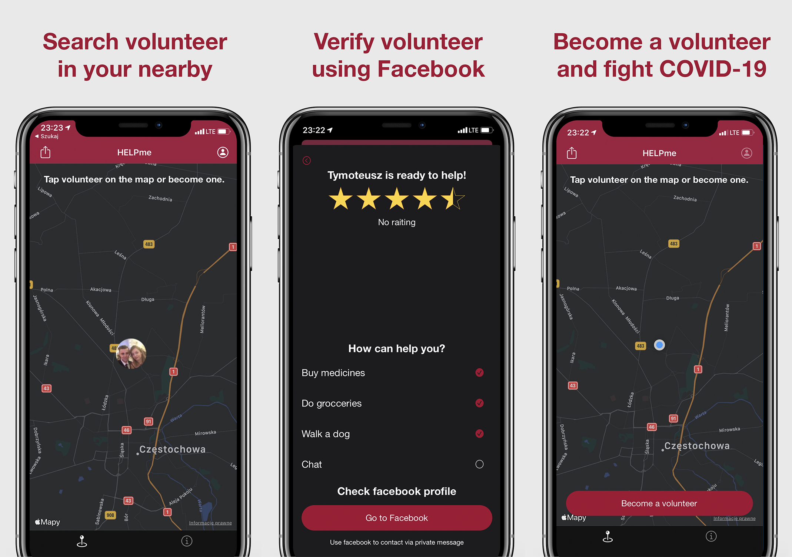
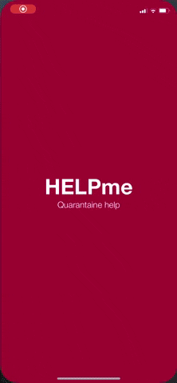
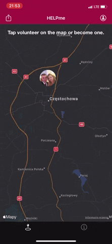
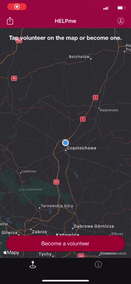

# HELPme - quarantine help
An application created to help people in need during the COVID-19 pandemic. People who are in quarantine or who are at risk of suffering from a severe disease may find volunteers who want to help them.

## Table of contents
* [General info](#general-info)
* [Screenshots](#screenshots)
* [Technologies](#technologies)
* [Features](#features)
* [Setup](#setup)
* [Contact](#contact)
* [License](#license)


## General info

The application was created in march 2020 during the SARS-CoV2 pandemic.
Millions of people around the world have experienced the threat of the virus. Many of them were forced to stay at home. Others were simply afraid of infection.
Simple activities like shopping or walking the dog have become impossible or dangerous.

People who need help could find volunteers in the application. Volunteers could register through the application indicating what kind of help they offer.

To guarantee safety, every volunteer had to first register using his Facebook profile.
The list of volunteers is shown on the map and store in Firebase Realtime Database.

Unfortunately the app was rejected from publication due to Apple Policy during pandemic.

## Screenshots

<!--  -->
## Technologies/Frameworks/Design Patterns
- [x] MVVM
- [x] Facebook Login
- [x] Firebase Realtime Database to store data
- [x] Firebase authentication
- [x] Firebase encoder using `Codable`
- [x] [Cosmos](https://github.com/evgenyneu/Cosmos) framework for rating volunteer
- [x] Dependency Injection
- [x] `MapKit`, `UIKit`, `StoreKit`
- [x] Translation - polish, english, italian, french

## Features
- [x] Find nearest volunteer on the map
- [x] View the volunteer facebook profile and rating
- [x] Rate volunteer

  

- [x] Become volunteer
- [x] Log through facebook
- [x] Choose how you can help
- [x] Delete volunteer account

  


## Setup
1. Clone project
2. Install [CocoaPods](https://guides.cocoapods.org/using/getting-started.html)
2. Open Terminal and run `pod install`
3. In order for Firebase to work, create a [new project](https://console.firebase.google.com/u/0/) for your application.
4. Download ```GoogleService-Info.plist``` from your newly created Firebase project and replace it with the old one.
6. Create [Firebase Firestore](https://firebase.google.com/docs/firestore/quickstart)
7. Set Database rules to:
```
{
  "rules": {
     ".read": true,
     ".write": true     
  }
}
```

## Contact
Created by [@tymoteusz.pasieka](http://wheelo.com.pl/) - feel free to contact me!

## License
MIT License

Copyright 2020 Tymoteusz Pasieka

Permission is hereby granted, free of charge, to any person obtaining a copy of this software and associated documentation files (the "Software"), to deal in the Software without restriction, including without limitation the rights to use, copy, modify, merge, publish, distribute, sublicense, and/or sell copies of the Software, and to permit persons to whom the Software is furnished to do so, subject to the following conditions:

The above copyright notice and this permission notice shall be included in all copies or substantial portions of the Software.

THE SOFTWARE IS PROVIDED "AS IS", WITHOUT WARRANTY OF ANY KIND, EXPRESS OR IMPLIED, INCLUDING BUT NOT LIMITED TO THE WARRANTIES OF MERCHANTABILITY, FITNESS FOR A PARTICULAR PURPOSE AND NONINFRINGEMENT. IN NO EVENT SHALL THE AUTHORS OR COPYRIGHT HOLDERS BE LIABLE FOR ANY CLAIM, DAMAGES OR OTHER LIABILITY, WHETHER IN AN ACTION OF CONTRACT, TORT OR OTHERWISE, ARISING FROM, OUT OF OR IN CONNECTION WITH THE SOFTWARE OR THE USE OR OTHER DEALINGS IN THE SOFTWARE.
